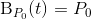

# Curva de Bézier
## O que é?
A curva de Bézier é uma curva paramétrica expressa como a interpolação linear entre determinados pontos de controle. 
Seu cálculo tem como base os polinômios de Bernstein, sendo estes definidos utilizando-se os coeficientes gerados pelo
binômio de Newton. Tomando como base *n* pontos de controle, tem-se que o grau da curva será *n - 1*.

## Definição recursiva
A curva de Bézier de grau *n* pode ser expressa recursivamente como uma combinação linear ponto-a-ponto de pares de pontos
correspodentes em duas outras curvas de grau *n - 1*. Dessa forma, temos

 
