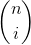

# Curva de Bézier
## O que é?
A curva de Bézier é uma curva paramétrica expressa como a interpolação linear entre determinados pontos de controle. 
Seu cálculo tem como base os polinômios de Bernstein, sendo estes definidos utilizando-se os coeficientes gerados pelo
binômio de Newton. Tomando como base *n* pontos de controle, tem-se que o grau da curva será *n - 1*.

## Definição recursiva
A curva de Bézier de grau *n* pode ser definida recursivamente como uma combinação linear ponto-a-ponto de pares de pontos
correspodentes em duas outras curvas de grau *n - 1*. Dessa forma, temos:

  

Sendo  os pontos de controle da curva.

## Definição explícita
A fórmula de cálculo dos pontos da curva pode ser expressa como:  
 ()

onde  se refere ao binômio de Newton.

Tomando a definição anterior como base, temos que:  
   

## Implementação
A curva de Bézier foi implementada utilizando o triângulo de Pascal para obter os coeficientes resultantes do binômio
de Newton. Assim, pelas fórmulas descritas acima é possível obter o polinômio de Bernstein e, por consequência, calcular
os pontos da curva de Bézier.  

O parâmetro *t* descrito acima, e representado no código como parâmetro *u*, é inicializado com o valor zero e incrementado
de acordo com um valor definido como *step*. Também baseado neste valor, calcula-se a quantidade de pontos a serem determinadas
para a curva. Por fim, toma-se a quantidade de pontos de controle - 1 como sendo o grau da curva (*n*), sendo este o mesmo *n*
descrito na combinação presente no polinômio de Bernstein. Vale ressaltar que a quantidade de pontos de controle é determinada
pelo usuário, no momento em que ele clica na ferramenta referente à curva de Bézier.
